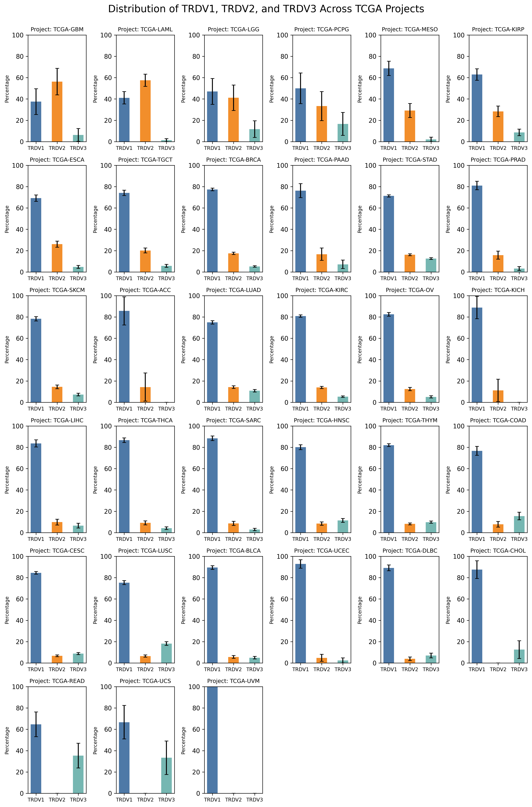
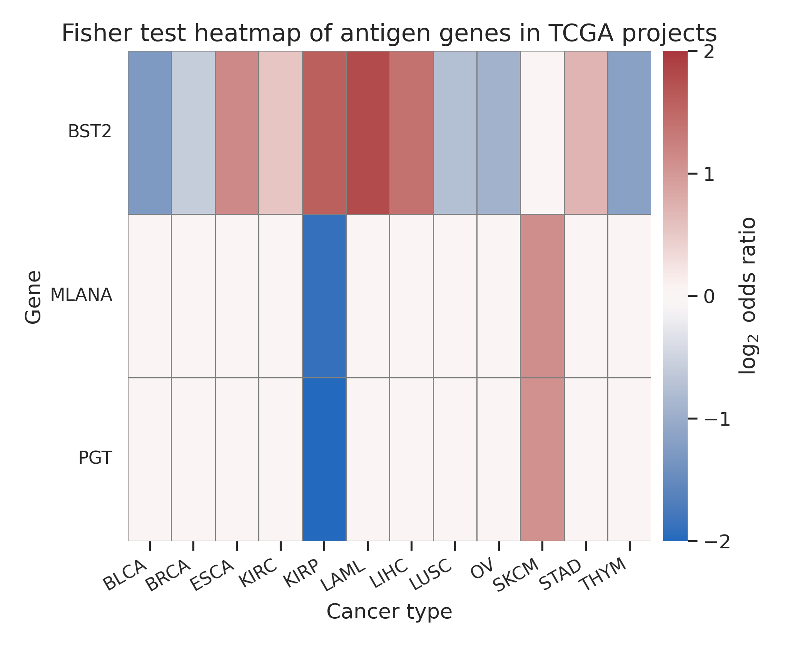
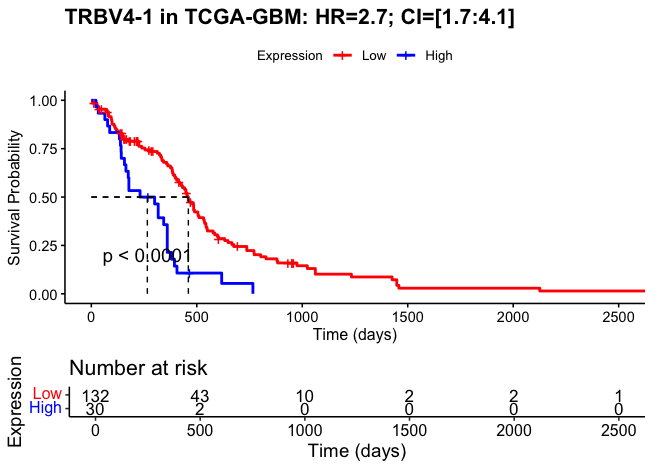
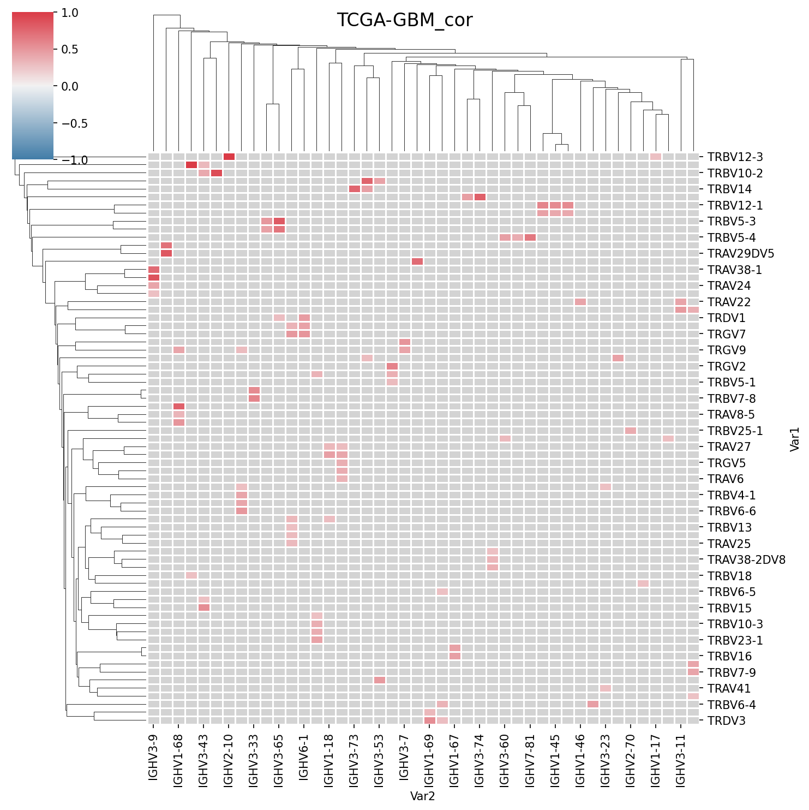
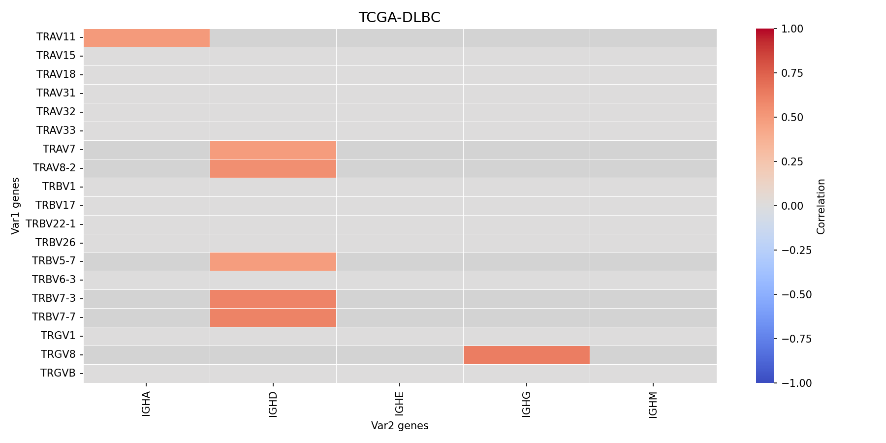
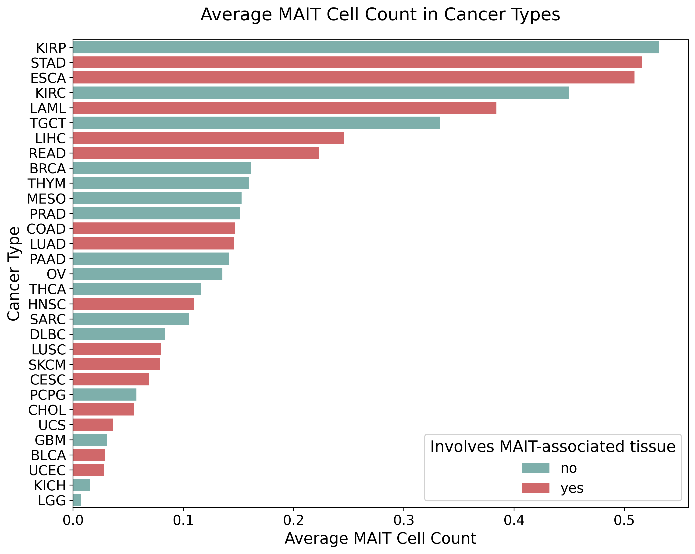
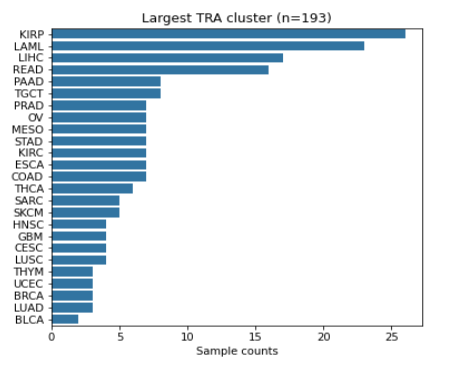
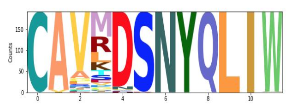
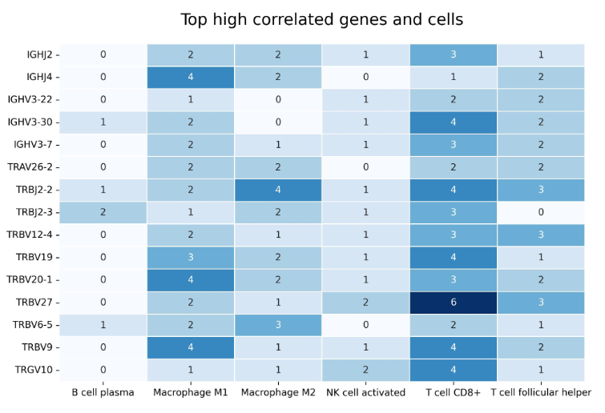

# Exploring tissue specific adaptive immunity features via RNA sequencing data

---

**Students:** Victoria Basova, Ryazantsev Dmitrii

**Supervisors:** Daniil Luppov, Mikhail Shugai

## Table of context

- [Project description](#project-description)
  - [Project goal and objectives](#project-goal-and-objectives)
  - [Data](#data)
  - [Results](#results)
  - [References](#references)
- [Project navigation](#project-navigation)
---

# Project description

---

## Project goal and objectives

---

Our goals and objectives!!!

## Data

---
TCGA, VDJdb and so on

## Results

---

Results and plots

## References

---

References for databases and literature

# Project navigation

---

```angular2html
Exploring-adaptive-immunity-via-RNAseq/
│
├── MIXCR_healthy_tissues/           # Calculated CSV files with MiXCR clone data for healthy tissues
│   ├── brain_clones.csv
│   ├── colon_clones.csv
│   ├── eye_clones.csv
│   └── skin_clones.csv
│
├── notebooks/                       # Jupyter Notebooks with main analysis
│   ├── 1_airr_data_statistical_analysis.ipynb    # Statistical analysis of TCGA repertoire data
│   ├── 2_vdjdb_analysis.ipynb                    # Analysis using VDJdb epitope mapping
│   └── 3_healthy_tissues.ipynb                   # Analysis of healthy tissues repertoire extracted via MIXCR
│
├── plots/                           # Generated plots and figures
│
├── scripts/                         # Python and R scripts used in the analysis
│   ├── __init__.py                  
│   ├── correlation_functions.py     # Functions for computing and plotting correlation matrices
│   ├── regression_functions.py      # Regression functions for gene expression vs cancer types
│   ├── survival_plots.R             # R script for survival analysis visualizations
│   └── vdjdb_functions.py           # Enrichment and overlap analysis with VDJdb epitopes
│
├── R.requirements.txt               # List of R packages needed for R scripts
├── requirements.txt                 # Python dependencies
└── README.md                        # Project overview 

```


# OLD DATA

---

- [Plot A](#plot-a)
- [Plot B](#plot-b)
- [Plot C](#plot-c-examples-of-plots)
- [Plot D](#plot-d)
- [Plot E](#plot-e)

---

## Plot A

This plot shows the percentage ratio of *TRDV1*, *TRDV2*, *TRDV3* usage 
in δ-chain of TCR in TCGA projects in descending order of *TRDV2* %

Top 3 *TRDV2*% projects:

- GBM: Glioblastoma Multiforme

- LAML: Acute Myeloid Leukemia

- LGG: Lower Grade Glioma



---

## Plot B

This plot shows the heatmap of log<sub>2</sub> odds ratio 
of Fisher test, showing the difference in abundance of T-cell receptors
to specific human antigens.



---

## Plot C: examples of plots

1. Kaplan–Meier plot for TRBV4-1 expression in TCGA-GBM: 

A Hazard Ratio of 2.7 shows that
patients with high TRBV4-1 expression have a 2.7-fold higher risk of death than those with low expression.



2. Clustermap of correlation coefficients between TCR and BCR V-genes
in TCGA-GBM project (insignificant correlations masked with gray)



3. Heatmap of correlation between TCR V-genes and IGH С-genes
in TCGA-DLBC project (insignificant correlations masked with gray)



---

## Plot D

1. Histogram of MAIT-cells abundance in different TCGA projects. 
Red/Green bars show whether the tissue of cancer origin in healthy
condition is associated with MAIT-cells.



2. Histogram of the largest TRA CDR3 cluster shows precentages 
of samples from different TCGA projects that make up the cluster



3. Logo of the largest TRA cluster



---

## Plot E

The heatmap shows number of significant correlations between receptor genes
and cell types




